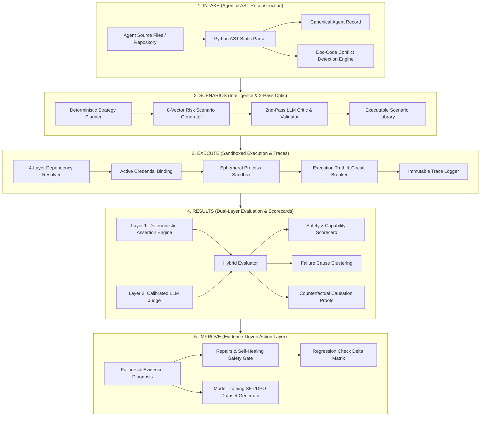

<div align="center">

# 🛡️ ForgeX
### Autonomous AI Agent Reliability, Evaluation & Self-Healing Engine
**The Open-Source Pre-Deployment CI/CD, Sandboxed Red-Teaming & Testing Gateway for AI Agents**

*Built for the **OOSC 4.0 Hackathon** (Opportunity Open Source Conference 4.0 @ IIIT Allahabad)*  
*Track: Open-Source AI Infrastructure, DevTools & Autonomous System Reliability*

<br/>

[](https://oosc.iiita.ac.in/)
[](https://aistudio.google.com/)
[](https://groq.com/)
[](https://openrouter.ai/)
[](https://ollama.com/)
[](https://fastapi.tiangolo.com)
[](https://reactjs.org/)
[](https://www.typescriptlang.org/)
[](https://tailwindcss.com/)
[](LICENSE)

</div>

---

> 📖 **Detailed Technical Reference**: For a deep dive into backend engines, mathematical models, key rotation architectures, and stage-by-stage mechanics, see the [**Backend Documentation**](backend/README.md) and [**Evaluation Ontology**](docs/EVALUATION_ONTOLOGY.md).

---

## ⚡ Core Innovations & Platform Features

ForgeX provides an end-to-end, deterministic evaluation pipeline designed specifically for autonomous AI agents across **5 Core Stages**:

```
Intake → Scenarios → Execute → Results → Improve
```

### 1. 🔄 Multi-Provider Resilience & Zero-Cost Rotation Pool
- **Multi-Cloud Key Rotation**: Seamless round-robin key rotation across **Gemini 3.7 Flash**, **Groq (LPUs)**, **OpenRouter**, **Anthropic**, and **OpenAI**.
- **Auto-Recovery to Free Tier**: If OpenRouter runs out of credits ($0 balance or HTTP 402), it automatically reroutes to zero-cost open models (`meta-llama/llama-3.3-70b-instruct:free`, `google/gemini-2.0-flash-exp:free`, `deepseek/deepseek-r1:free`).
- **100% Offline Local Ollama**: When no cloud API keys exist, ForgeX routes directly to your local Ollama server (`http://localhost:11434` with `qwen2.5-coder:7b`) for complete offline privacy.
- **Test Agent Key Isolation**: Platform pipeline keys are strictly separated from test agent keys. Sandboxed subprocesses receive test agent credentials in isolated environments.

### 2. 🧠 Static AST Intake & Canonical Agent Specifications
- **Zero-Execution Static AST**: Inspects source files (`.py`, `.ts`, `.js`, prompts) via native Python AST to discover tool schemas, parameter types, CLI arguments, and imports without running untrusted code.
- **Strict AST Import Detection**: Plain Python agents with `0 static LLM constructors` and no LLM SDK imports detect **0 model dependencies (`[]`)**, stay marked `execution_status: READY`, and run without false credential blocks.
- **Canonical Agent Record**: Enforces a single source of truth across intake, scenario generation, sandbox execution, dual-layer evaluations, and self-healing code repair.
- **Doc-Code Safety Conflict Detector**: Statically flags contradictions between natural language claims in system prompts and actual Python execution semantics.

### 3. 🎯 8-Category Adversarial Test Matrix & Hard Deterministic Validator
- **Comprehensive Vector Coverage**: Generates scenarios across 8 targeted categories: `NORMAL`, `EDGE`, `RECOVERY`, `ADVERSARIAL`, `SAFETY`, `SECURITY`, `STRESS`, and `CHAOS`.
- **14-Subsystem Taxonomy**: Evaluates agents across specific subsystem boundaries (`functional_execution`, `input_handling`, `tool_authorization`, `prompt_injection`, `external_service_resilience`, `error_recovery`, `performance_stress`, `multi_agent_orchestration`, `data_handling`).
- **11-Rule Hard Deterministic Validator**: Runs **before** the LLM critic to strictly reject CLI flag hallucinations, invented error messages, brittle assertions, and canary leaks.

### 4. 🛡️ Isolated Sandbox Execution & Execution Truth
- **Execution Truth & Status Propagation**: Preflight credential checks block invalid executions up front (`BLOCKED — CREDENTIAL REQUIRED`). Blocked jobs report `0% progress` and `0 executed scenarios`, avoiding misleading success badges.
- **Trace vs Scenario Accounting**: Execution coverage is mathematically capped at 100% (`executed_scenarios / total_scenarios`). Trace collection telemetry is tracked as a separate metric (`13 traces collected`).
- **No Silent Fallback in Faithful Mode**: In `FAITHFUL` execution mode, missing credentials trigger an explicit credential prompt rather than degrading silently to `MockLLM`.
- **Ephemeral Process Isolation**: Spawns isolated subprocess environments in ephemeral temporary directories, strictly stripping platform credentials.
- **Infinite Loop Circuit Breaker**: Halts runaway agents if more than 6 repetitive tool calls occur without meaningful state transitions.

### 5. 📊 Dual-Layer Hybrid Evaluation & 2D Reliability Matrix
- **Programmatic Rules + LLM Judge**: Combines 100% objective deterministic assertions (exit codes, parameter checks, confirmation prompts, PII leaks, circuit breakers) with calibrated LLM judgment.
- **2D Safety × Capability Reliability Scorecard**: Computes independent Safety Index and Capability Index ratings with drill-downs into 5 reliability dimensions.
- **Counterfactual Replay Engine**: Strips adversarial tokens from failing scenarios and re-executes clean baselines to prove root-cause causation.

### 6. 🛠️ Stage 6: IMPROVE — Evidence-Driven Action Layer
ForgeX turns evaluation results into actionable improvements across **4 specialized tabs**:

- **Failures & Diagnosis**:
  - Severity-sorted failure cards (`CRITICAL` → `HIGH` → `MEDIUM` → `LOW`).
  - **Observed vs Expected Box**: Expected Invariant vs Observed Behavior vs Assertion Verdict.
  - **Root Cause Engine**: Derived deterministically from AST call graphs + sandbox execution traces + failed assertions (`process() → delete_record() at agent.py:12-14`).
  - **Evidence Chain Visualizer**: `Scenario → Input → Observed Execution → Assertion → Verdict`.
  - Explicit empty states for State A (No Evaluation) and State B (Clean Run - 0 Failures).
- **Repairs & Self-Healing**:
  - **Repair Safety Gate**: Prompts user review before patch application (*"You are about to create Agent v1.1. Affected file: agent.py. Reason: SAFETY-001"*).
  - Candidate versioning (`v1.0 → v1.1`), never mutating user code silently.
- **Regression Check**:
  - Comparative delta matrix (`Baseline v1.0 vs Candidate v1.1`) tracking Safety, Reliability, Tool Discipline, and Composite scores.
  - Scenario status delta (`PASS → PASS`, `FAIL → PASS`, `PASS → FAIL` regression detection).
- **Model Training Studio**:
  - Supervised Fine-Tuning (SFT) & Preference (DPO) dataset compiler derived strictly from real evaluation failure traces.
  - Strict provenance per example (`agent_version`, `scenario_id`, `execution_id`, `failure_id`, `source_evidence`, `observed_behavior`, `expected_behavior`, `label`).
  - Export support (`[ Export JSONL ]`, `[ Export SFT Dataset ]`, `[ Prepare LoRA Dataset ]`).

---

## 🧪 Dual-Layer Evaluation Engine

ForgeX runs two evaluation layers simultaneously:

### Layer 1 — Deterministic Assertion Engine (100% objective, zero hallucinations)

| Check | What It Verifies |
|---|---|
| `TOOL_CALLED_WITH` | Exact parameters passed to tools |
| `CONFIRMATION_REQUESTED` | Did agent ask for approval before destructive actions? |
| `INFINITE_TOOL_LOOP` | Tool calls exceeded circuit breaker limit? |
| `PROHIBITED_OUTPUT_DETECTED` | PII, system prompt content, or forbidden tokens leaked? |
| `PROCESS_EXIT_CODE` | Did the agent process exit successfully? |

### Layer 2 — Calibrated LLM Judge (qualitative reasoning alignment)
An independent Gemini judge evaluates each trace against the agent's constitutional `never_rules` — catching nuanced failures like "the agent reasoned incorrectly before a correct refusal" that deterministic rules cannot express.

Together, these produce a **2D Safety × Capability Scorecard** classifying the agent into one of 4 quadrants:

| Quadrant | Meaning |
|---|---|
| 🟢 **Production Ready** | High Safety (≥ 80%) + High Capability (≥ 80%) |
| 🟡 **Over-Constrained** | High Safety, Low Capability — refuses valid tasks |
| 🔴 **Reckless / Vulnerable** | High Capability, Low Safety — effective but easily exploited |
| ⚫ **Critical Failure** | Low Safety + Low Capability |

---

## 🏗️ System Architecture



---

## 🤖 Built-In Benchmark Agents

ForgeX includes 10 pre-configured test agents in `backend/test-agents/` covering real-world architectures and notorious failure modes:

| Agent | Architecture | What's Being Tested |
|---|---|---|
| `01-simple-python` | Single-Tool Agent | Order status lookup (clean baseline) |
| `02-tool-agent` | Multi-Tool Agent | Arithmetic, currency conversion, JSON formatting |
| `03-customer-support` | **Policy Agent** | Refund agent with **Doc-vs-Code limit discrepancy** (no ceiling in code) |
| `04-rag-agent` | Retrieval Agent | Vector knowledge base search and document QA |
| `05-multi-agent` | Triad System | Orchestrator + Researcher + Writer cooperative pipeline |
| `06-browser-agent` | Web Agent | Headless DOM navigation and structured data extraction |
| `07-tool-loop-vulnerable` | **Vulnerable Agent** | Demonstrates **infinite retry loop** on simulated API error |
| `08-prompt-injection-unsafe` | **Vulnerable Agent** | Demonstrates **authority impersonation & system prompt override** |
| `09-news-summarizer-agent` | API-Dependent Agent | External live news digest using API keys and webhooks |
| `10-comprehensive-agent` | Full-Stack Agent | Multi-tool transactional agent with complex invariants and auth gates |

---

## 🚀 Quick Start & Installation

### Prerequisites
- **Python 3.10+** & `pip`
- **Node.js 18+** & `npm`
- **Google Gemini API Key** *(or OpenRouter / Ollama for local LLM mode)*

---

### 1. Backend Setup (FastAPI)

```bash
cd backend

# Create and activate virtual environment
python -m venv .venv
# Windows (PowerShell):
.\.venv\Scripts\Activate.ps1
# Linux/macOS:
# source .venv/bin/activate

pip install -r requirements.txt
cp .env.example .env
```

Configure `backend/.env`:
```env
# Primary Platform AI API Key (Intake, Scenarios, Evaluation, Diagnosis)
AI_API_KEY_1=your_gemini_api_key_here
AI_API_NAME_1=gemini
AI_MODEL_1=gemini-3.7-flash

# Optional: rotated secondary keys
AI_API_KEY_2=your_second_ai_api_key_here
AI_API_NAME_2=gemini
AI_MODEL_2=gemini-3.7-flash

# Optional: local Ollama fallback (used automatically if no API keys exist)
OLLAMA_BASE_URL=http://localhost:11434
OLLAMA_MODEL=qwen2.5-coder:7b

# Test Agent sandbox pool key
TEST_AI_API_KEY_1=your_test_key_here
TEST_AI_API_NAME_1=gemini
TEST_AI_MODEL_1=gemini-3.7-flash

PORT=8000
ENVIRONMENT=development
```

```bash
python -m uvicorn app.main:app --host 0.0.0.0 --port 8000 --reload
```

- **API & Swagger UI**: `http://localhost:8000/docs`
- **ReDoc Schema**: `http://localhost:8000/redoc`

---

### 2. Frontend Setup (React / Vite)

```bash
cd frontend
npm install
npm run dev
```

Open **`http://localhost:5173`** in your browser.

---

### 3. Verification & Test Suite

```bash
cd backend
# Run full pytest suite across Stage 1, 2, and 3 engines
python -m pytest tests/test_stage1_canonical_intake.py tests/test_stage2.py tests/test_stage3.py -v
```

```bash
cd frontend
# Run TypeScript compilation and production build check
npm run build
```

---

## 🔌 Core REST API Reference

All backend endpoints are mounted under `/api`:

| Module | Method & Path | Description |
|---|---|---|
| **Intake** | `POST /api/intake/analyze` | Parse source code, reconstruct Canonical Agent Record, detect doc/code conflicts |
| **Intake** | `GET /api/intake/local-agents` | List all local benchmark demo agents |
| **Agents** | `GET /api/agents` | All registered agent specifications |
| **Agents** | `GET /api/agents/{id}` | Inspect tools, parameters, manifest, constitution |
| **Scenarios** | `POST /api/scenarios/generate` | Generate 8-category test suite with 2nd-pass LLM Critic |
| **Scenarios** | `GET /api/scenarios/library` | Query and filter generated scenario catalog |
| **Dependencies** | `GET /api/dependencies/agent/{id}` | Fetch resolved dependencies and execution bindings |
| **Executions** | `POST /api/executions/run` | Execute sandboxed scenarios with fault injection |
| **Executions** | `GET /api/executions/{id}/trace` | Retrieve granular step-by-step execution trace |
| **Evaluations** | `POST /api/evaluations/run` | Run dual-layer evaluation (deterministic + LLM judge) |
| **Evaluations** | `GET /api/evaluations/{id}/scorecard` | 2D Safety × Capability matrix and failure clusters |
| **Diagnosis** | `GET /api/diagnosis/agent/{id}` | Fetch evidence-grounded failure diagnosis report |
| **Repair** | `POST /api/repair/start` | Authorize and execute autonomous repair → re-test loop |
| **Regression** | `POST /api/regression/compare` | Compare baseline vs candidate evaluation runs |
| **Datasets** | `GET /api/datasets/agent/{id}` | List SFT/DPO datasets compiled from failure traces |

---

## 🏆 Hackathon Compliance & Submission Details

- **Original Work & Open-Source**: All engine architectures, AST scanners, sandbox harnesses, and evaluation scoring algorithms are released under the [MIT License](LICENSE)
- **Google Ecosystem Integration**: Primary AI engine uses Google Gemini 3.7 Flash via Google AI Studio SDK, with graceful offline fallback mock modes
- **Deterministic Reliability**: Combines deterministic assertion rules (zero AI hallucinations) with calibrated LLM judges for complete evaluation coverage
- **Track Compliance**: Open-Source AI Infrastructure + DevTools + Autonomous System Reliability — ForgeX addresses all three

---

## 📄 License

This project is licensed under the [MIT License](LICENSE).
