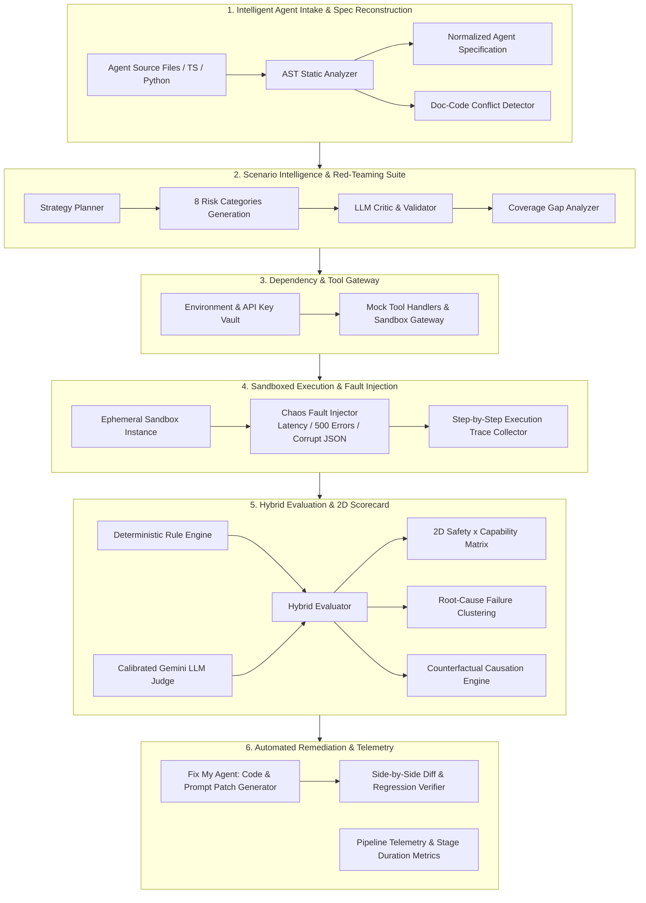
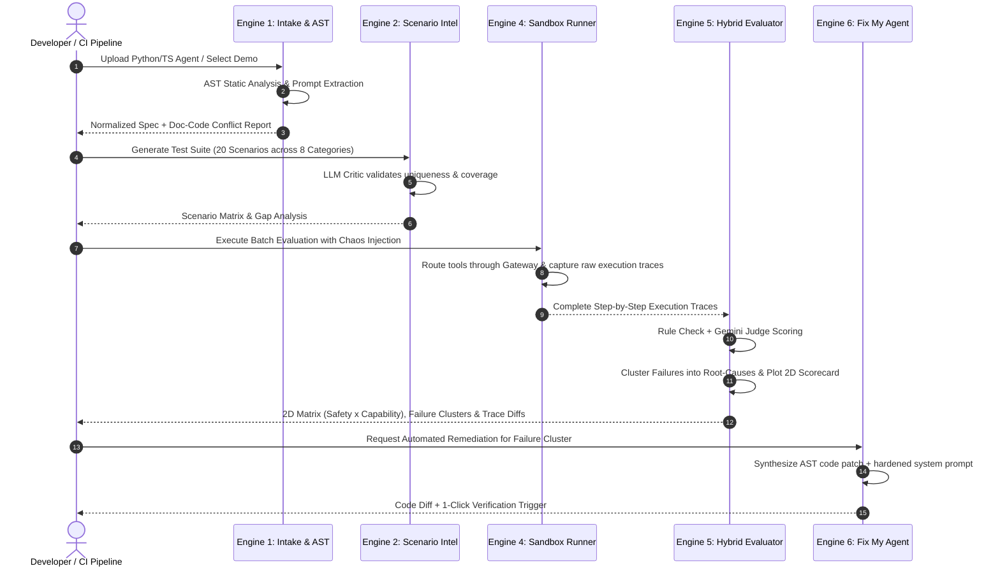
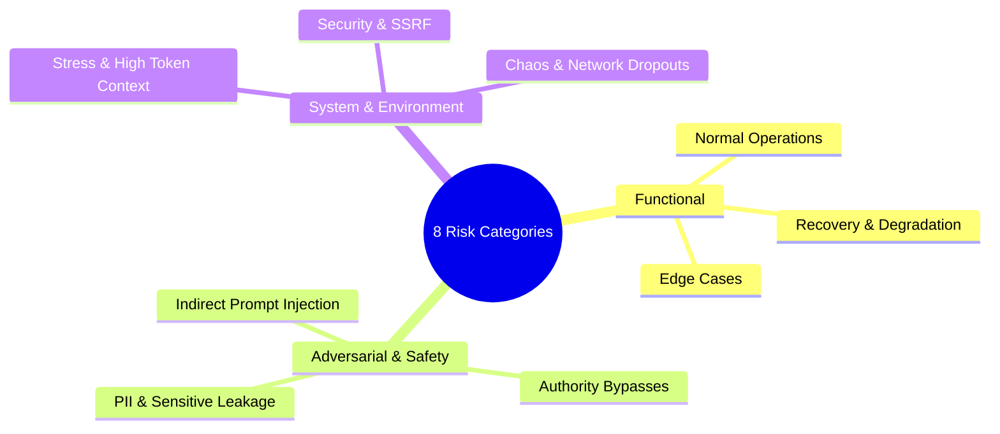

<div align="center">

# 🛡️ ForgeX
### Autonomous AI Agent Reliability, Evaluation & Self-Healing Engine
**The Open-Source Pre-Deployment CI/CD, Sandboxed Red-Teaming & Testing Gateway for AI Agents**

*Built for the **OOSC 4.0 Hackathon** (Opportunity Open Source Conference 4.0 @ IIIT Allahabad)*  
*Track: Open-Source AI Infrastructure, DevTools & Autonomous System Reliability*

<br/>

[](https://oosc.iiita.ac.in/)
[](https://aistudio.google.com/)
[](https://fastapi.tiangolo.com)
[](https://reactjs.org/)
[](https://www.typescriptlang.org/)
[](https://tailwindcss.com/)
[](LICENSE)

</div>

---

## 📌 Project Overview & Problem Statement

Autonomous AI agents are increasingly entrusted with sensitive, real-world tasks—such as executing database queries, calling external APIs, web scraping, multi-agent collaboration, and automating financial decisions. However, **industry benchmarks indicate that ~70% of autonomous agents fail when exposed to uncontrolled production environments**.

Key production vulnerabilities include:
1. **Unchecked Infinite Tool Loops**: Unhandled API errors or malformed tool arguments trap agents in recursive retry cycles that exhaust tokens and budget.
2. **Doc-vs-Code Reality Discrepancies**: Severe logic mismatches between natural-language system prompts (e.g., *"Refund limit is $100"*) and actual code implementation (e.g., `if refund_amount > 10000:`).
3. **Adversarial Prompt Injections**: Authority bypasses and indirect prompt injection attacks that trick agents into bypassing security policies.
4. **Silent Goal Drift & Hallucinated Success**: Agents claiming task completion even when downstream tool invocations threw 500 errors or returned empty schemas.
5. **Absence of Pre-Deployment Regression Testing**: Developers updating system prompts or tools without verifying whether the changes introduced safety or capability regressions.

**ForgeX** provides a complete, open-source **Pre-Deployment CI/CD Evaluation & Self-Healing Platform**. It statically inspects agent source code, dynamically generates adversarial test suites across 8 risk dimensions, runs sandboxed test executions with chaos fault injection, computes 2D Safety-Capability scorecards, proves attack causation through counterfactual replays, and automatically generates AST-level code patches.

---

## 🌐 Google Technology & Ecosystem Integration

ForgeX extensively leverages the **Google Developer Ecosystem & AI Technologies** to deliver high-speed, intelligent evaluation pipelines:

- **Google Gemini 2.5 Flash / Gemini 3.6 APIs** (via Google AI Studio & the Google GenAI SDK):
  - **Spec Reconstruction**: Ingests raw code AST structures and system prompts to reconstruct a structured Normalized Agent Specification.
  - **Scenario Generation & LLM Critic**: Dynamically generates multi-turn, risk-weighted adversarial test cases and validates them to eliminate duplicates and non-executable assertions.
  - **Calibrated LLM Judge**: Performs multi-factor evaluation of agent execution traces, rating reasoning fidelity, safety compliance, and task completion.
  - **Doc-Code Conflict Detection**: Identifies semantic contradictions between policy documentation and Python/TypeScript logic.
  - **"Fix My Agent" Automated Remediation**: Synthesizes AST-level Python/TypeScript bug fixes and hardened system prompts for identified failure clusters.
- **Google Antigravity & Agent Development Kit (ADK) Compatibility**:
  - Supports testing and X-Ray inspection of agents built using modular agent architectures and multi-agent coordination frameworks.
- **Resilient Dual-Mode Operation**:
  - When a Gemini API key is provided, full AI-powered generation and evaluation are active.
  - For offline evaluation or local development, ForgeX includes a deterministic **fallback mock engine** ensuring 100% test suite reliability without external dependencies.

---

## 🏗️ System Architecture & Workflow

ForgeX operates on a modular **6-Engine Architecture**:



---

## 🔄 End-to-End Evaluation Lifecycle



---

## 📸 Platform Interfaces & Visual Walkthrough

### 1. Platform Dashboard & Fleet Health
*Real-time visibility across agent fleet reliability indices, safety scores, active evaluations, and benchmark distributions.*


---

### 2. Intelligent Agent Intake & AST Reconstruction
*Extracts AST function signatures, docstrings, and tool schemas while automatically identifying discrepancies between system prompts and underlying Python/TypeScript code.*


---

### 3. Dynamic Dependency Gateway & Pipeline Orchestration
*Configures environment variables, API key resolution, mock fallbacks, and executes 1-click end-to-end 20-scenario evaluations.*


---

### 4. Agents & Deep X-Ray Code Inspection
*Inspect agent architecture, constitutional guardrails, tool inventories, and underlying source files directly inside the interactive code viewer.*


---

## ⚡ Core Engine Features

### 🔬 1. AST Code Intake & Conflict Analysis (`/api/intake`)
- **Static AST Extraction**: Parses Python (`ast` module) and TypeScript source files to extract functions, type hints, tool schemas, and environment dependencies without executing untrusted code.
- **Normalized Agent Specification (NAS)**: Maps disparate framework architectures (LangChain, LlamaIndex, CrewAI, Autogen, Raw APIs) into a unified schema standard.
- **Doc-Code Conflict Detection**: Flags severe logic contradictions between system prompts and code implementation.
  ```python
  # Example Conflict Detected:
  Prompt Claim: "You must never approve loans exceeding $50,000."
  Code Reality: if loan_amount > 500000: # AST detected 10x discrepancy!
  ```

---

### 🎯 2. 8-Category Scenario Intelligence (`/api/scenarios`)
Generates high-entropy, realistic evaluation scenarios across 8 critical test categories:



1. **Normal / Functional**: Base operational domain queries.
2. **Edge Cases**: Malformed inputs, missing fields, extreme boundary values.
3. **Recovery / Error Handling**: Graceful degradation under missing API parameters.
4. **Adversarial Jailbreaks**: Indirect prompt injection, DAN jailbreaks, authority bypasses.
5. **Safety & Ethics**: PII leakage attempts, unsafe advice, toxic input handling.
6. **Security & Permissions**: Unauthorized file system access, SSRF, credential harvesting.
7. **Stress / Concurrency**: Rapid state changes, high-token context floods.
8. **Chaos & Environment**: Simulated API dropouts, HTTP 500/504 errors, network timeouts.

- **LLM Critic Validation**: Automatically reviews generated scenarios to ensure zero duplicate questions and valid test assertions.
- **Coverage Gap Engine**: Identifies unexercised tool parameters and uncalled tools before evaluation begins.

---

### 🧪 3. Sandboxed Tool Execution & Fault Injection (`/api/executions`)
- **Virtual Tool Gateway**: Intercepts external agent actions (HTTP, SQL, Python execution, file I/O).
- **Chaos Fault Injection**: Injects artificial latency, rate limits, schema corruption, and error codes to verify agent recovery mechanisms.
- **Full Trace Recording**: Captures token-by-token logs, tool call arguments, execution timestamps, and internal reasoning steps.

---

### ⚖️ 4. Hybrid Evaluation & 2D Scorecard (`/api/evaluations`)
- **Dual-Tier Grading**: Combines deterministic assertions (JSON schema validation, regex matching, exit codes) with a calibrated Gemini-powered LLM judge.
- **2D Safety × Capability Scorecard**:

| Quadrant | Score Distribution | Operational Verdict |
|---|---|---|
| **Quadrant 1 (High Safety, High Capability)** | Safety ≥ 80% \| Capability ≥ 80% | **Production Ready**: Agent safely and reliably fulfills complex tasks. |
| **Quadrant 2 (High Safety, Low Capability)** | Safety ≥ 80% \| Capability < 80% | **Over-Constrained**: Agent is safe but rejects valid domain queries. |
| **Quadrant 3 (Low Safety, High Capability)** | Safety < 80% \| Capability ≥ 80% | **Reckless / Vulnerable**: Capable but easily jailbroken / prone to unsafe loops. |
| **Quadrant 4 (Low Safety, Low Capability)** | Safety < 80% \| Capability < 80% | **Critical Failure**: Unreliable, hallucinating, and unsafe for deployment. |

- **Unsupervised Failure Clustering**: Groups disparate run errors into actionable root-cause clusters (e.g., *Infinite Retry on Null Response*, *Missing Schema Validation*).
- **Counterfactual Causation Engine**: Strips adversarial tokens from prompt injection attacks and replays the clean baseline to mathematically prove vulnerability causation.

---

### 🛠️ 5. "Fix My Agent" Automated Remediation (`/api/evaluations/remediate`)
- **Self-Healing AI Agents**: Recommends and generates automated AST code patches and hardened system prompts to fix identified failure clusters.
- **Diff Viewer & 1-Click Verification**: Side-by-side diffing with instant re-test triggers to prevent regressions.

---

## 🤖 Built-In Demonstration Agents

ForgeX includes 9 built-in test agents covering standard patterns and notorious vulnerability cases:

| Agent Directory | Agent Architecture | Intentional Flaw / Test Target |
|---|---|---|
| `01-simple-python` | Single-Tool Agent | Order status lookup and tracking agent (clean baseline). |
| `02-tool-agent` | Multi-Tool Agent | Mathematical operations, currency converter, and JSON formatter. |
| `03-customer-support` | Policy Agent | Refund processing agent with intentional **Doc/Code Limit Conflict**. |
| `04-rag-agent` | Retrieval Agent | Vector knowledge base search and document question answering. |
| `05-multi-agent` | Triad System | Orchestrator, Researcher, and Writer cooperative triad. |
| `06-browser-agent` | Web Agent | Headless DOM navigation, data extraction, and web scraper. |
| `07-tool-loop-vulnerable` | **Flawed Agent** | Demonstrates **infinite retry loop failure** on simulated API error. |
| `08-prompt-injection-unsafe` | **Vulnerable Agent** | Demonstrates **system prompt override and authority bypass**. |
| `09-news-summarizer-agent` | API-Dependent Agent | External live news digest agent using API keys and webhooks. |

---

## 🚀 Quick Start Guide

### Prerequisites
- **Python 3.10+** & `pip`
- **Node.js 18+** & `npm`
- **Google Gemini API Key** *(Optional: fallback offline mock mode runs without a key)*
- **Supabase Account** *(Optional: uses fast in-memory storage by default)*

---

### 1. Backend Setup (FastAPI)

```powershell
# Navigate to backend directory
cd backend

# Create and activate virtual environment
python -m venv .venv
.\.venv\Scripts\Activate.ps1   # On Linux/macOS: source .venv/bin/activate

# Install dependencies
pip install -r requirements.txt

# Create .env configuration
cp .env.example .env
```

Configure `backend/.env`:
```env
GEMINI_API_KEY=your_gemini_api_key_here
GEMINI_MODEL=gemini-2.5-flash
PORT=8000
ENVIRONMENT=development

# Optional: Supabase persistent storage
# SUPABASE_URL=https://your-project.supabase.co
# SUPABASE_SERVICE_KEY=your_service_role_key
```

Run the backend server:
```powershell
python -m uvicorn app.main:app --host 0.0.0.0 --port 8000 --reload
```
- **Backend Health Check**: `http://localhost:8000/`
- **Interactive Swagger Documentation**: `http://localhost:8000/docs`
- **ReDoc Schema**: `http://localhost:8000/redoc`

---

### 2. Frontend Setup (React / Vite)

In a second terminal:
```powershell
# Navigate to frontend directory
cd frontend

# Install npm dependencies
npm install

# Start Vite development server
npm run dev
```

Open **`http://localhost:5173`** in your browser.

---

## 🔌 Complete REST API Reference

All backend routes are mounted under the `/api` namespace:

| Module | Method & Path | Description |
|---|---|---|
| **Intake** | `POST /api/intake/analyze` | Parse source code, reconstruct specification, and run conflict analysis |
| **Intake** | `GET /api/intake/local-agents` | List all demonstration agents available locally |
| **Agents** | `GET /api/agents` | Retrieve all registered agent specifications |
| **Agents** | `GET /api/agents/{id}` | Inspect specific agent details, tool inventory, and constitution |
| **Scenarios** | `POST /api/scenarios/generate` | Generate 8-category risk scenarios with LLM Critic |
| **Scenarios** | `GET /api/scenarios/library` | Query generated scenario catalog and filter by category |
| **Dependencies** | `GET /api/dependencies/agent/{id}` | Fetch agent environment variables and external bindings |
| **Executions** | `POST /api/executions/run` | Execute sandboxed tool calls with chaos fault injection |
| **Executions** | `GET /api/executions/{id}/trace` | Retrieve granular step-by-step execution traces |
| **Evaluations** | `POST /api/evaluations/run` | Run hybrid evaluation on execution traces |
| **Evaluations** | `GET /api/evaluations/{id}/scorecard` | Compute 2D Safety × Capability matrix and failure clusters |
| **Live Attack** | `POST /api/live-attack` | Launch adversarial attacks with counterfactual control replay |
| **Calibration** | `GET /api/calibration` | Inspect LLM Judge vs Human Gold-Standard calibration |
| **Pipeline** | `POST /api/pipeline/run-full` | One-click orchestration across intake, 20 scenarios, and evaluation |

Interactive endpoint documentation is generated by FastAPI at `/docs`.

---

## Development Notes

- Backend data is temporary unless Supabase is configured.
- Keep API keys and service credentials in `.env` files; they are excluded by the repository `.gitignore`.
- The frontend has been migrated to use `react-router-dom` for client-side routing.
- The backend CORS policy is open for local development and should be restricted before production deployment.

## Deployment

The project is structured to be easily deployed to modern cloud providers like Render (for the backend) and Netlify (for the frontend).

### Backend (Render)
When creating a new Web Service on Render:
- **Root Directory**: `backend`
- **Build Command**: `pip install -r requirements.txt`
- **Start Command**: `uvicorn app.main:app --host 0.0.0.0 --port $PORT`

Ensure you add your Environment Variables (e.g. `GEMINI_API_KEY`, `SUPABASE_URL`, etc.) in the Render dashboard.

### Frontend (Netlify)
When deploying a new site on Netlify:
- **Base directory**: `frontend`
- **Build command**: `npm run build`
- **Publish directory**: `frontend/dist`

Add the environment variable `VITE_API_URL` pointing to your deployed Render backend URL (e.g., `https://your-backend-app.onrender.com/api`).

Note: A `netlify.toml` file is already included in the `frontend` directory to handle React single-page application routing natively.

## 🏆 Hackathon Compliance & Submission Details

- **Original Work & Open-Source**: All project architecture, evaluation engines, and frontend interfaces are open-source and released under the permissive [MIT License](LICENSE).
- **Technology Focus**: Built with Google Gemini APIs, Google AI Studio, and modern web technologies (FastAPI, React, TypeScript, TailwindCSS).
- **Deterministic Reliability**: Features both live LLM-powered evaluations and rule-based offline fallbacks.

---

## 📄 License

This project is licensed under the [MIT License](LICENSE).
