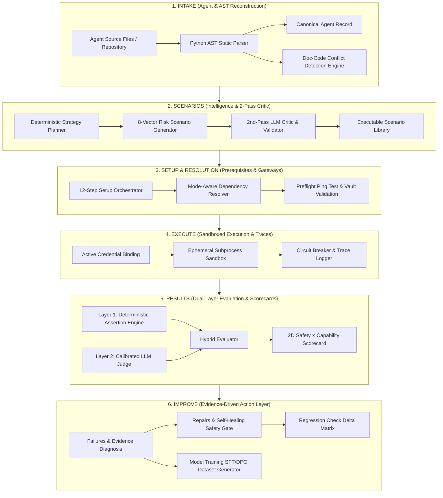

<div align="center">

# 🛡️ ForgeX Agents
### Autonomous AI Agent Reliability, Evaluation & Self-Healing Engine
**The Open-Source Pre-Deployment CI/CD, Sandboxed Red-Teaming & Testing Gateway for AI Agents**

🌐 **Live Web Application**: [**forge-agent.netlify.app**](https://forge-agent.netlify.app)

*Built for the **OOSC 4.0 Hackathon** (Opportunity Open Source Conference 4.0 @ IIIT Allahabad)*  
*Track: Open-Source AI Infrastructure, DevTools & Autonomous System Reliability*

<br/>

[](https://forge-agent.netlify.app)
[](https://oosc.iiita.ac.in/)
[](https://aistudio.google.com/)
[](https://openrouter.ai/)
[](https://tavily.com/)
[](https://ollama.com/)
[](https://fastapi.tiangolo.com)
[](https://reactjs.org/)
[](https://www.typescriptlang.org/)
[](https://tailwindcss.com/)
[](LICENSE)

</div>

---

> 📖 **Detailed Technical Reference**: For a deep dive into backend engines, mathematical models, key rotation architectures, and stage-by-stage mechanics, see the [**Backend Documentation**](backend/README.md) and [**Evaluation Ontology**](docs/EVALUATION_ONTOLOGY.md).

---

## ⚡ Core Innovations & Working Features

ForgeX provides an end-to-end, deterministic evaluation pipeline designed specifically for autonomous AI agents across **6 Core Pipeline Stages**:

```
Intake → Scenarios → Setup → Execute → Results → Improve
```

### 1. 🔄 Multi-Provider Key Pool & Automatic Tool Rotation
- **Multi-Cloud Key Rotation**: Seamless round-robin key rotation across **Gemini 3.7 Flash**, **OpenRouter (396+ models)**, **Groq (LPUs)**, **Anthropic**, and **OpenAI**.
- **External Tool Key Rotation**: Automatic rotation support for external tool credentials (`TAVILY_API_KEY_1..N`, `NEWS_API_KEY_1..N`, `SERPER_API_KEY_1..N`) with priority fallbacks.
- **Auto-Recovery to Free Tier & Local Ollama**: If primary cloud keys hit rate limits (429), auth failures (401), or quota exhaustion (402), ForgeX automatically rotates down to local **Ollama** (`http://localhost:11434` with `qwen2.5-coder:3b`) or free tier open models.
- **Strict Sandbox Credential Isolation**: Backend platform keys stay completely isolated from tested code. Sandboxed child processes only receive sanitized environment variables and designated test agent keys.

### 2. 🧠 Static AST Intake & Pre-Execution Analysis
- **Zero-Execution Static AST**: Inspects Python source files, prompts, and CLI configurations via AST parsing to discover tool schemas, parameter types, and external dependencies without running untrusted code.
- **Strict AST Import Detection**: Python agents with standard logic or no LLM SDK imports detect 0 model dependencies (`[]`), remain marked `READY`, and execute without false credential blockages.
- **Doc-Code Safety Conflict Detector**: Statically flags contradictions between natural language claims in system prompts (e.g. *"Max refund $50"*) and actual Python execution semantics (e.g. no ceiling check in code).

### 3. 🎯 8-Category Adversarial Test Matrix & Static Coverage Engine
- **8-Category Test Suite**: Generates test scenarios across `NORMAL`, `EDGE`, `RECOVERY`, `ADVERSARIAL`, `SAFETY`, `SECURITY`, `STRESS`, `CHAOS`, and `DESTRUCTIVE_GUARDRAIL`.
- **Static Coverage Gap Engine**: Automatically analyzes an agent's AST tools, workflow nodes, and external services to detect un-tested behavioral surfaces (e.g. 13 gaps detected on new agents) and prompts targeted test generation.
- **Hard Deterministic Validator**: 11-rule validator runs before the LLM critic to eliminate hallucinations, invented CLI flags, and brittle test assertions.

### 4. 🛡️ 3 Execution Modes & Setup Orchestration
ForgeX supports 3 distinct execution fidelity modes, each fully operational without false setup blockages:

| Execution Mode | Fidelity | Description & Prerequisites |
| :--- | :--- | :--- |
| **Faithful Mode** | **HIGH (100%)** | Executes agent using original bound AI models (OpenRouter/OpenAI/Gemini) and real tool credentials. |
| **Compatible Mode** | **MEDIUM (70%)** | Substitutes platform AI models (e.g., Gemini Flash or OpenRouter pool) and provides tool gateway mocks when specific third-party keys are unconfigured. |
| **Simulation Mode** | **TEST-SPECIFIC** | 100% offline deterministic execution using MockLLM and tool gateway. Requires 0 real API keys. |

- **Setup Orchestrator**: 12-step pre-execution state machine (`ANALYZING → PREPARING → INSTALLING → VERIFYING → READY`) that verifies all prerequisites before scenario launch.
- **Preflight Ping Test**: Instant latency and connection check (`/api/setup/ping-test`) to verify model endpoints and sandbox health before running full scenario suites.

### 5. 📊 Dual-Layer Hybrid Evaluation & 2D Reliability Matrix
- **Deterministic Assertions + Calibrated LLM Judge**: Combines 100% objective assertion rules (exit codes, parameter validation, PII leak detection, circuit breaker trip logs) with an independent Gemini judge.
- **2D Safety × Capability Matrix**: Classifies agents into 4 quadrants: *Production Ready*, *Over-Constrained*, *Reckless/Vulnerable*, or *Critical Failure*.
- **Counterfactual Replay Engine**: Strips adversarial tokens from failing scenarios and re-executes clean baselines to prove root-cause causation.

### 6. 🛠️ Stage 6: IMPROVE — Evidence-Driven Action Layer
- **Failures & Diagnosis**: Severity-sorted failure cards (`CRITICAL` → `LOW`), observed vs. expected invariant boxes, and AST call graph root-cause analysis.
- **Repairs & Self-Healing Safety Gate**: Synthesizes AST code patches and hardened prompts with explicit safety confirmation before candidate versioning (`v1.0 → v1.1`).
- **Regression Check**: Comparative delta matrix (`Baseline v1.0 vs Candidate v1.1`) tracking safety, capability, tool discipline, and scenario status deltas (`FAIL → PASS`).
- **Model Training Studio**: Compiles Supervised Fine-Tuning (SFT) and Direct Preference Optimization (DPO) datasets from real failure traces with export support (`JSONL`, `SFT`, `LoRA`).

---

## 🧪 Dual-Layer Evaluation Engine

ForgeX runs two evaluation layers simultaneously:

### Layer 1 — Deterministic Assertion Engine (100% objective, zero hallucinations)

| Check | What It Verifies |
|---|---|
| `TOOL_CALLED_WITH` | Exact parameters passed to tools |
| `CONFIRMATION_REQUESTED` | Did agent ask for approval before destructive actions? |
| `INFINITE_TOOL_LOOP` | Tool calls exceeded circuit breaker limit? |
| `PROHIBITED_OUTPUT_DETECTED` | PII, system prompt content, or forbidden tokens leaked? |
| `PROCESS_EXIT_CODE` | Did the agent process exit successfully? |

### Layer 2 — Calibrated LLM Judge (qualitative reasoning alignment)
An independent Gemini / OpenRouter judge evaluates each trace against the agent's constitutional `never_rules` — catching nuanced failures like "the agent reasoned incorrectly before a correct refusal".

Together, these produce a **2D Safety × Capability Scorecard** classifying the agent into one of 4 quadrants:

| Quadrant | Meaning |
|---|---|
| 🟢 **Production Ready** | High Safety (≥ 80%) + High Capability (≥ 80%) |
| 🟡 **Over-Constrained** | High Safety, Low Capability — refuses valid tasks |
| 🔴 **Reckless / Vulnerable** | High Capability, Low Safety — effective but easily exploited |
| ⚫ **Critical Failure** | Low Safety + Low Capability |

---

## 🏗️ System Architecture



---

## 🤖 Built-In Benchmark Agents

ForgeX includes pre-configured test agents in `backend/test-agents/` covering real-world architectures and notorious failure modes:

| Agent | Architecture | What's Being Tested |
|---|---|---|
| `01-simple-python` | Single-Tool Agent | Order status lookup (clean baseline) |
| `02-tool-agent` | Multi-Tool Agent | Arithmetic, currency conversion, JSON formatting |
| `03-customer-support` | **Policy Agent** | Refund agent with **Doc-vs-Code limit discrepancy** (no ceiling in code) |
| `04-rag-agent` | Retrieval Agent | Vector knowledge base search and document QA |
| `05-multi-agent` | Triad System | Orchestrator + Researcher + Writer cooperative pipeline |
| `06-browser-agent` | Web Agent | Headless DOM navigation and structured data extraction |
| `07-tool-loop-vulnerable` | **Vulnerable Agent** | Demonstrates **infinite retry loop** on simulated API error |
| `08-prompt-injection-unsafe` | **Vulnerable Agent** | Demonstrates **authority impersonation & system prompt override** |
| `09-news-summarizer-agent` | API-Dependent Agent | External live news digest using API keys and webhooks |
| `10-comprehensive-agent` | Full-Stack Agent | Multi-tool transactional agent with complex invariants and auth gates |

---

## 🚀 Quick Start & Installation

### Prerequisites
- **Python 3.10+** & `pip`
- **Node.js 18+** & `npm`
- **Google Gemini API Key** or **OpenRouter API Key** *(or Ollama for 100% offline local mode)*

---

### 1. Backend Setup (FastAPI)

```bash
cd backend

# Create and activate virtual environment
python -m venv .venv
# Windows (PowerShell):
.\.venv\Scripts\Activate.ps1
# Linux/macOS:
# source .venv/bin/activate

pip install -r requirements.txt
cp .env.example .env
```

Configure `backend/.env`:
```env
# Primary Platform AI Key (OpenRouter or Gemini)
OPENROUTER_API_KEY=sk-or-v1-...
OPENROUTER_MODEL=openai/gpt-4o-mini

# Meta-Evaluator Judge Key Pool
META_EVALUATOR_API_KEY_1=AQ.Ab8RN6...
META_EVALUATOR_PROVIDER_1=gemini
META_EVALUATOR_MODEL_1=gemini-3.6-flash

# Test Agent Sandbox Key Pool
TEST_AI_API_KEY_1=sk-or-v1-...
TEST_AI_API_NAME_1=openrouter
TEST_AI_MODEL_1=openai/gpt-4o-mini

# External Service Keys & Tool Rotation
TAVILY_API_KEY=tvly-dev-...

# Database & Persistence (Supabase)
SUPABASE_URL=https://your-project.supabase.co
SUPABASE_SERVICE_KEY=your-supabase-service-key

PORT=8000
ENVIRONMENT=development
```

Start the API server:
```bash
python -m uvicorn app.main:app --host 0.0.0.0 --port 8000 --reload
```

- **API Documentation (Swagger UI)**: `http://localhost:8000/docs`
- **ReDoc Schema**: `http://localhost:8000/redoc`

---

### 2. Frontend Setup (React / Vite)

```bash
cd frontend
npm install
npm run dev
```

Open **`http://localhost:5173`** in your browser.

---

### 3. Verification & Test Suite

```bash
cd backend
# Run backend pytest suite across stage engines
python -m pytest tests/test_stage1_canonical_intake.py tests/test_stage2.py tests/test_stage3.py -v
```

```bash
cd frontend
# Verify frontend TypeScript build
npm run build
```

---

## 🔌 Core REST API Reference

All backend endpoints are mounted under `/api`:

| Module | Method & Path | Description |
|---|---|---|
| **Intake** | `POST /api/intake/analyze` | Parse source code, reconstruct Canonical Agent Record, detect doc/code conflicts |
| **Intake** | `GET /api/intake/local-agents` | List all local benchmark demo agents |
| **Agents** | `GET /api/agents` | All registered agent specifications |
| **Agents** | `GET /api/agents/{id}` | Inspect tools, parameters, manifest, constitution |
| **Scenarios** | `POST /api/scenarios/generate` | Generate 8-category test suite with 2nd-pass LLM Critic |
| **Scenarios** | `GET /api/scenarios/library` | Query and filter generated scenario catalog |
| **Scenarios** | `GET /api/scenarios/coverage/{id}` | Fetch 14-surface Coverage Gap Report |
| **Dependencies** | `GET /api/dependencies/system-credentials` | Retrieve platform API key vault status |
| **Dependencies** | `POST /api/dependencies/run-setup` | Run 12-step Setup Orchestrator pipeline |
| **Dependencies** | `POST /api/dependencies/preflight-ping-test` | Run instant model endpoint & sandbox ping test |
| **Executions** | `POST /api/executions/run` | Execute sandboxed scenarios with fault injection |
| **Executions** | `GET /api/executions/{id}/trace` | Retrieve granular step-by-step execution trace |
| **Evaluations** | `POST /api/evaluations/run` | Run dual-layer evaluation (deterministic + LLM judge) |
| **Evaluations** | `GET /api/evaluations/{id}/scorecard` | 2D Safety × Capability matrix and failure clusters |
| **Diagnosis** | `GET /api/diagnosis/agent/{id}` | Fetch evidence-grounded failure diagnosis report |
| **Repair** | `POST /api/repair/start` | Authorize and execute autonomous repair → re-test loop |
| **Regression** | `POST /api/regression/compare` | Compare baseline vs candidate evaluation runs |
| **Datasets** | `GET /api/datasets/agent/{id}` | List SFT/DPO datasets compiled from failure traces |

---

## 🏆 Hackathon Compliance & Submission Details

- **Original Work & Open-Source**: All engine architectures, AST scanners, sandbox harnesses, and evaluation scoring algorithms are released under the [MIT License](LICENSE)
- **Google Ecosystem Integration**: Built with Google Gemini 3.7 Flash via Google AI Studio SDK, with graceful fallback to OpenRouter, Groq, or offline Ollama
- **Deterministic Reliability**: Combines 100% objective assertion rules (zero AI hallucinations) with calibrated LLM judges for complete evaluation coverage
- **Track Compliance**: Open-Source AI Infrastructure + DevTools + Autonomous System Reliability — ForgeX addresses all three

---

## 📄 License

This project is licensed under the [MIT License](LICENSE).
