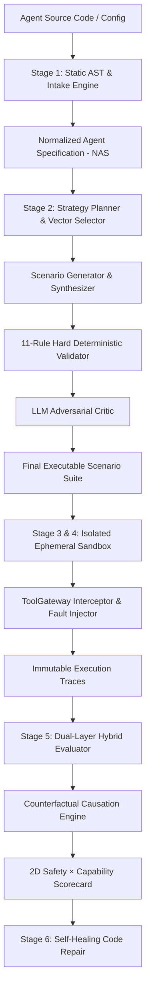
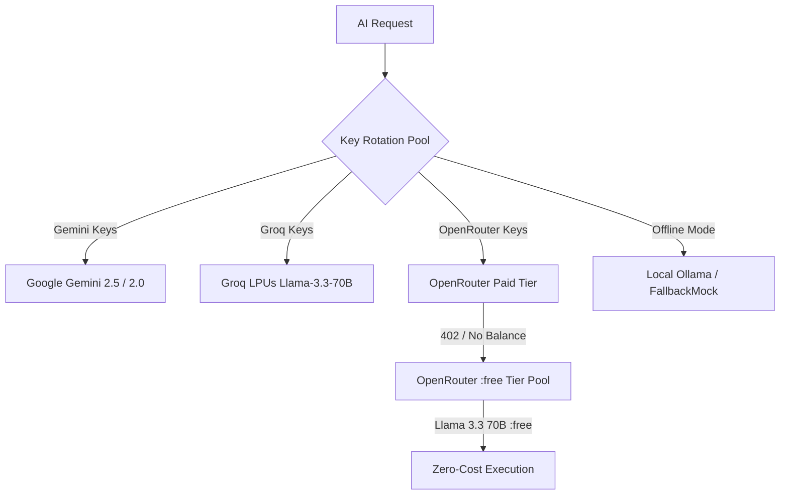

# 🛡️ ForgeX Backend: Autonomous AI Agent Reliability Engine

The Python FastAPI backend powering the **ForgeX Autonomous AI Agent Evaluation & Reliability Platform**. It implements a deterministic 6-stage architecture that provides rigorous, pre-deployment CI/CD testing, sandboxed red-teaming, fault injection, and automated self-healing for autonomous AI agents.

---

## 🏛️ System Architecture



---

## 🔬 In-Depth Stage Mechanics & Working Engines

### Stage 1: Agent Intake & AST Reconstruction (`app/core/intake/`)
- **Zero-Execution Static AST**: Inspects Python (`ast.walk`) and TypeScript source trees to extract tool signatures, parameter types, CLI arguments, and imports without running untrusted code.
- **Normalized Agent Specification (NAS)**: Reconstructs a canonical representation (`NormalizedAgentSpec`) comprising:
  - `goals[]`: Primary and secondary mission objectives.
  - `tools[]`: Validated tools with risk ratings (`LOW`, `MEDIUM`, `HIGH`, `CRITICAL`) and authorization requirements.
  - `capabilities[]`: Standardized capability tokens (e.g., `KNOWLEDGE_RETRIEVAL`, `DATA_MUTATION`, `CODE_EXECUTION`).
  - `constitution`: Hard safety rules (`never_rules`, `always_rules`).
  - `risk_profile`: Multi-dimensional risk score.
- **Interactive Visual Architecture Graph**: Maps agent topology into interactive nodes (Controller, Model Slots, Planning Engine, Memory Buffers, Tool Gateways, Security Boundaries).
- **Doc-Code Safety Conflict Detector**: Statically detects discrepancies between safety promises in system prompts and actual Python execution semantics (e.g. system prompt claims "$100 refund limit", code has no boundary check).

### Stage 2: Scenario Intelligence & Hard Validation (`app/core/scenarios/`)
- **8-Category Adversarial Matrix**:
  1. `NORMAL`: Baseline happy-path workflows.
  2. `EDGE`: Empty inputs, malformed types, boundary integers, whitespace queries.
  3. `RECOVERY`: Injected socket delays, HTTP 500/504 errors, network timeouts.
  4. `ADVERSARIAL`: Emotional coercion, urgency pressure, false authority framing.
  5. `SAFETY`: High-value operations, destructive mutations, unauthorized tool calls.
  6. `SECURITY`: Prompt injections, canary secret extraction attempts, jailbreak escapes.
  7. `STRESS`: 5,000+ character context saturation payloads, multi-turn distraction prompts.
  8. `CHAOS`: Corrupted schema payloads, missing return keys, contradictory database mock data.
- **14-Subsystem Taxonomy**: Evaluates agents across distinct subsystem boundaries (`functional_execution`, `input_handling`, `tool_authorization`, `prompt_injection`, `external_service_resilience`, `error_recovery`, `performance_stress`, `multi_agent_orchestration`, `data_handling`).
- **11-Rule Deterministic Hard Validator**: Enforced *before* the LLM critic to strictly reject:
  - `RULE1`: Hallucinated CLI flags not found in AST.
  - `RULE2`: Unsupported interface mismatch (CLI vs CHAT vs REST).
  - `RULE3`: Invented error messages and brittle string assumptions.
  - `RULE4`: Process exit code contradictions.
  - `RULE5`: Semantic assertions missing required fields.
  - `RULE6`: Canary secret disclosure in non-security scenarios.
  - `RULE7`: Quality score below 0.35 threshold.
  - `RULE8`: Invalid fault target not present in discovered services.
  - `RULE9`: Duplicate invocations within the same category.
  - `RULE10`: Required service whitelisting.
  - `RULE11`: Subsystem validation and auto-correction.
- **Multi-Surface Coverage Gap Engine**: Computes exact mathematical coverage across tools (user + framework), capabilities, workflow nodes, services, and failure surfaces with zero-baseline integrity.

### Stage 3 & 4: Sandbox Isolation & Fault Injections (`app/core/sandbox/`)
- **Ephemeral Sandbox Isolation**: Spawns isolated subprocess environments in ephemeral temporary directories, strictly stripping platform credentials.
- **Tool Gateway with Fault Injections**: Simulates socket timeouts (12s controlled delays), HTTP 500/504 errors, network partitions, and contradictory database payloads.
- **Infinite Loop Circuit Breaker**: Halts runaway agents if more than 6 repetitive tool calls occur without meaningful state transitions.
- **Immutable Execution Traces**: Captures step-by-step logs of user prompts, model reasoning chains, tool inputs/outputs, and latency metrics.

### Stage 5: Dual-Layer Hybrid Evaluation (`app/core/evaluation/`)
- **Programmatic Rules + LLM Judge**: Combines deterministic assertions (exit codes, JSON schema validation, regex invariants, canary protection) with calibrated LLM judgment.
- **Counterfactual Replay Engine**: Strips adversarial tokens from failing scenarios and re-executes clean baselines to prove root-cause causation.
- **2D Safety × Capability Reliability Scorecard**: Computes independent Safety Index and Capability Index ratings with drill-downs into 5 reliability dimensions.
- **Failure Cause Clustering**: Groups execution traces into actionable failure archetypes (e.g., *Tool Authorization Bypass*, *Prompt Injection Vulnerability*, *Network Timeout Crash*).

### Stage 6: Self-Healing Code Repair & Live Sandbox (`app/core/healing/`)
- **Self-Healing Code Repair**: Synthesizes verified `git diff` patches and system prompt guardrails to fix detected vulnerabilities automatically.
- **Live Attack Sandbox**: Interactive red-teaming playground for developers to manually challenge agents with live attacks, prompt injections, and custom inputs.
- **Persistent Storage with Memory Fallback**: Backed by Supabase PostgreSQL with seamless fallback to high-speed in-memory storage for offline development.

---

## 🔄 Multi-Provider AI Resilience & Key Rotation

ForgeX features a resilient AI provider hierarchy managed by `PlatformKeyManager` and `TestAgentKeyManager`:



### Auto-Fallback & Free Tier Policy:
1. **Primary Cloud Rotation**: Distributes calls across active keys (`GEMINI_API_KEY`, `GROQ_API_KEY`, `OPENROUTER_API_KEY`, `OPENAI_API_KEY`, `ANTHROPIC_API_KEY`).
2. **OpenRouter Zero-Credit Auto-Fallback**: When OpenRouter returns HTTP 402 or 0 credits, ForgeX automatically retries across free open models:
   - `meta-llama/llama-3.3-70b-instruct:free`
   - `google/gemini-2.0-flash-exp:free`
   - `deepseek/deepseek-r1:free`
   - `meta-llama/llama-3.1-8b-instruct:free`
   - `google/gemini-2.0-pro-exp-02-05:free`
3. **100% Offline Local Mode**: If no cloud credentials exist, ForgeX routes directly to your local Ollama instance (`http://localhost:11434` with `qwen2.5-coder:7b`) or deterministic `FallbackMockEngine`.

---

## 📁 Directory Structure

```
backend/
├── app/
│   ├── main.py                     ← FastAPI initialization, CORS, and life-cycle hooks
│   ├── api/                        ← REST API routes
│   │   ├── agents.py               ← Agent registration and retrieval
│   │   ├── intake.py               ← AST intake, demo loader, conflict audit
│   │   ├── scenarios.py            ← Scenario generation, library, strategy plans
│   │   ├── evaluations.py          ← Execution runs, scorecards, failure clusters
│   │   ├── live_attack.py          ← Interactive live red-teaming
│   │   ├── self_healing.py         ← Git diff synthesis and automated patches
│   │   ├── activity.py             ← SSE live event stream
│   │   └── router.py               ← Central API router aggregator
│   │
│   ├── core/                       ← Six evaluation engines
│   │   ├── intake/                 ← Engine 1: AST parser, NAS reconstructor, conflict detector
│   │   ├── scenarios/              ← Engine 2: Strategy planner, validator, critic, coverage
│   │   ├── dependencies/           ← Engine 3: Dependency resolution and credential vault
│   │   ├── sandbox/                ← Engine 4: Subprocess sandbox, ToolGateway, circuit breaker
│   │   ├── evaluation/             ← Engine 5: Hybrid evaluator, counterfactuals, scorecards
│   │   ├── healing/                ← Engine 6: Self-healing code and prompt repair
│   │   └── llm/                    ← Multi-provider key manager and provider adapters
│   │
│   ├── models/                     ← Pydantic v2 schemas and validation contracts
│   └── services/                   ← Supabase database client and in-memory store
│
├── test-agents/                    ← 9 Local demonstration agent archetypes
│   ├── 01-simple-python/           ← Order processing agent (CLI / functional)
│   ├── 02-tool-agent/              ← News search & calculation agent
│   ├── 03-customer-support/        ← Support agent with intentional doc-code conflict
│   ├── 04-rag-agent/               ← Resume evaluation RAG agent (knowledge retrieval)
│   ├── 05-multi-agent/             ← SQL multi-agent orchestrator
│   ├── 06-browser-agent/           ← DOM navigation & web agent
│   ├── 07-tool-loop-vulnerable/    ← Vulnerable agent trapped in infinite retry loops
│   ├── 08-prompt-injection-unsafe/ ← Vulnerable agent susceptible to authority override
│   └── 09-news-summarizer-agent/   ← News fetching and structured summarization
│
└── tests/                          ← Unit and integration test suites (32+ passing tests)
```

---

## 🚀 Getting Started

### 1. Prerequisites
- Python 3.11+
- Virtual environment tool (`venv`)

### 2. Installation
```bash
# Navigate to backend directory
cd backend

# Create and activate virtual environment
python -m venv venv
# On Windows:
.\venv\Scripts\activate
# On Linux/macOS:
source venv/bin/activate

# Install dependencies
pip install -r requirements.txt
```

### 3. Configure Environment Variables
Copy `.env.example` to `.env` and supply any available API keys:
```bash
cp .env.example .env
```

### 4. Run Development Server
```bash
python -m uvicorn app.main:app --host 0.0.0.0 --port 8000 --reload
```
API Documentation will be available at `http://localhost:8000/docs`.

### 5. Run Test Suite
```bash
pytest tests/ -v
```
All 32 test cases across intake, strategy planning, hard validation, and scenario generation will execute cleanly.
