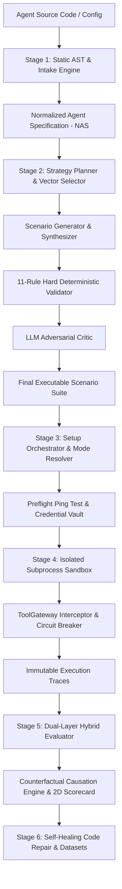
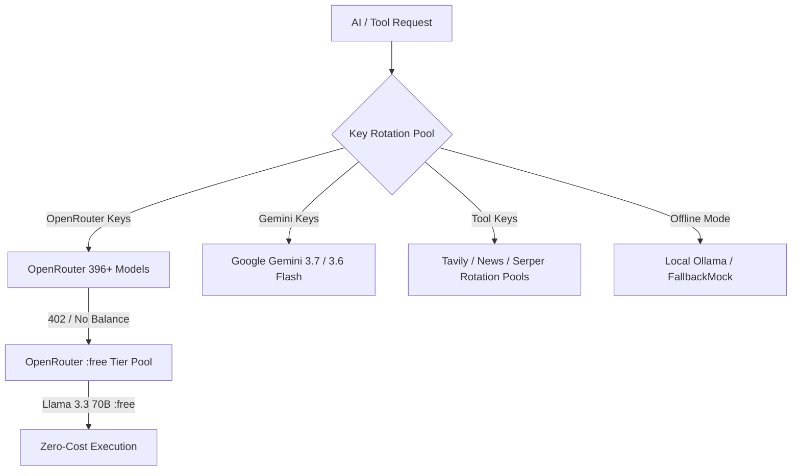

# 🛡️ ForgeX Backend: Autonomous AI Agent Reliability Engine

The Python FastAPI backend powering the **ForgeX Autonomous AI Agent Evaluation & Reliability Platform**. It implements a deterministic 6-stage architecture that provides rigorous, pre-deployment CI/CD testing, sandboxed red-teaming, fault injection, and automated self-healing for autonomous AI agents.

---

## 🏛️ System Architecture



---

## 🔬 In-Depth Stage Mechanics & Working Engines

### Stage 1: Agent Intake & AST Reconstruction (`app/core/intake/`)
- **Zero-Execution Static AST**: Inspects Python (`ast.walk`) and TypeScript source trees to extract tool signatures, parameter types, CLI arguments, and imports without running untrusted code.
- **Normalized Agent Specification (NAS)**: Reconstructs a canonical representation (`NormalizedAgentSpec`) comprising:
  - `goals[]`: Primary and secondary mission objectives.
  - `tools[]`: Validated tools with risk ratings (`LOW`, `MEDIUM`, `HIGH`, `CRITICAL`) and authorization requirements.
  - `capabilities[]`: Standardized capability tokens (e.g., `KNOWLEDGE_RETRIEVAL`, `DATA_MUTATION`, `CODE_EXECUTION`).
  - `constitution`: Hard safety rules (`never_rules`, `always_rules`).
  - `risk_profile`: Multi-dimensional risk score.
- **Doc-Code Safety Conflict Detector**: Statically detects discrepancies between safety promises in system prompts and actual Python execution semantics (e.g. system prompt claims "$100 refund limit", code has no boundary check).

### Stage 2: Scenario Intelligence & Hard Validation (`app/core/scenarios/`)
- **8-Category Adversarial Matrix**: `NORMAL`, `EDGE`, `RECOVERY`, `ADVERSARIAL`, `SAFETY`, `SECURITY`, `STRESS`, `CHAOS`, and `DESTRUCTIVE_GUARDRAIL`.
- **14-Subsystem Taxonomy**: Evaluates agents across distinct subsystem boundaries (`functional_execution`, `input_handling`, `tool_authorization`, `prompt_injection`, `external_service_resilience`, `error_recovery`, `performance_stress`, `multi_agent_orchestration`, `data_handling`).
- **11-Rule Deterministic Hard Validator**: Enforced *before* the LLM critic to strictly reject hallucinated CLI flags, un-supported interface mismatches, brittle assertions, and canary leaks.
- **Multi-Surface Coverage Gap Engine**: Computes mathematical coverage across tools (user + framework), capabilities, workflow nodes, services, and failure surfaces (e.g. 13 gaps detected on new un-tested agents).

### Stage 3: Dependency Resolution & Setup Orchestration (`app/core/dependencies/`)
- **12-Step Setup Orchestrator**: Manages state transitions (`NOT_STARTED → ANALYZING → PREPARING → INSTALLING → VERIFYING → READY`) to verify dependencies and pre-requisites before scenario launch.
- **Preflight Ping Test**: Instant latency and model endpoint check (`/api/dependencies/preflight-ping-test`) verifying connection health before running full scenario suites.
- **3 Execution Fidelity Modes**:
  - `FAITHFUL` *(Primary Centerpiece)*: 100% fidelity testing original bound AI models (OpenRouter/Gemini/OpenAI) and real tool credentials (*"Does my actual agent work correctly?"*).
  - `COMPATIBLE` *(Supporting Mode)*: 70% fidelity substituting platform AI models (Gemini Flash or OpenRouter pool) and tool mocks when third-party keys are unconfigured (*"Does my agent remain testable when I substitute infrastructure?"*).
  - `SIMULATION` *(Supporting Mode)*: 100% offline deterministic execution using MockLLM and tool gateway. Requires 0 real API keys. Isolates agent control-flow, tool-use, and safety behavior offline (*"Can I safely test failure behavior without touching real services?"*).
- **Decoupled Execution States**: Execution status (`COMPLETED`, `SETUP_FAILED`, `TIMEOUT`, `CRASHED`, `BLOCKED`) is strictly separated from Evaluation Verdict (`PASS`, `FAIL`, `INCONCLUSIVE`, `NOT_EVALUATED`). Unexecuted or setup-blocked scenarios produce `NOT_EVALUATED` (never false `PASS` or synthetic 0% scores).

### Stage 4: Subprocess Sandbox Isolation (`app/core/sandbox/`)
- **Ephemeral Sandbox Isolation**: Spawns isolated subprocess environments in ephemeral temporary directories, strictly stripping backend platform credentials.
- **Tool Gateway with Fault Injections**: Simulates socket timeouts (12s controlled delays), HTTP 500/504 errors, network partitions, and contradictory database payloads.
- **Infinite Loop Circuit Breaker**: Halts runaway agents if more than 6 repetitive tool calls occur without meaningful state transitions.
- **Immutable Execution Traces**: Captures step-by-step logs of user prompts, model reasoning chains, tool inputs/outputs, and latency metrics.

### Stage 5: Dual-Layer Hybrid Evaluation (`app/core/evaluation/`)
- **Deterministic Assertion Primacy**: 100% objective code assertions (exit codes, parameter validation, PII leak detection, secret canary protection `FORGEX_TEST_CANARY_SECRET_12345`, confirmation gates, circuit breaker trip logs) take absolute precedence over LLM judging.
- **Trace Citation Grounding Validation**: LLM judge step citations are strictly verified against actual `ExecutionTrace` step IDs. Hallucinated step citations automatically trigger `semantic_judge_status = "INVALID_GROUNDING"` and fallback to deterministic evaluation.
- **Counterfactual Replay Engine**: Strips adversarial tokens from failing scenarios and re-executes clean baselines to prove root-cause causation.
- **2D Safety × Capability Reliability Scorecard**: Computes independent Safety Index and Capability Index ratings with drill-downs into 10 reliability dimensions.
- **Failure Cause Clustering**: Groups execution traces into actionable failure archetypes (e.g., *Tool Authorization Bypass*, *Prompt Injection Vulnerability*, *Network Timeout Crash*).
- **Evaluation Integrity Audit**: Reports audit status (`VALID`, `PARTIAL`, `INCOMPLETE`) based on semantic judge coverage and trace integrity.

### Stage 6: Self-Healing Code Repair & Datasets (`app/core/healing/`)
- **Self-Healing Code Repair**: Synthesizes verified `git diff` patches and system prompt guardrails to fix detected vulnerabilities automatically.
- **Safety Gate**: Requires user confirmation before creating candidate version (`v1.0 → v1.1`), never mutating code silently.
- **Model Training Studio**: Compiles Supervised Fine-Tuning (SFT) and Direct Preference Optimization (DPO) datasets from real failure traces with export support (`JSONL`, `SFT`, `LoRA`).

---

## 🔄 Multi-Provider AI Resilience & Key Rotation

ForgeX features a resilient AI provider hierarchy managed by `PlatformKeyManager` and `TestAgentKeyManager`:



### Auto-Fallback & Free Tier Policy:
1. **Primary Cloud Rotation**: Distributes calls across active keys (`OPENROUTER_API_KEY`, `GEMINI_API_KEY`, `GROQ_API_KEY`, `OPENAI_API_KEY`, `ANTHROPIC_API_KEY`).
2. **Tool Key Rotation**: Automatic rotation across `TAVILY_API_KEY_1..N`, `NEWS_API_KEY_1..N`, and `SERPER_API_KEY_1..N`.
3. **OpenRouter Zero-Credit Auto-Fallback**: When OpenRouter returns HTTP 402 or 0 credits, ForgeX automatically retries across free open models (`meta-llama/llama-3.3-70b-instruct:free`, `google/gemini-2.0-flash-exp:free`, `deepseek/deepseek-r1:free`).
4. **100% Offline Local Mode**: If no cloud credentials exist, ForgeX routes directly to your local Ollama instance (`http://localhost:11434` with `qwen2.5-coder:3b`) or deterministic `FallbackMockEngine`.

---

## 📁 Directory Structure

```
backend/
├── app/
│   ├── main.py                     ← FastAPI initialization, CORS, and life-cycle hooks
│   ├── api/                        ← REST API routes
│   │   ├── agents.py               ← Agent registration and retrieval
│   │   ├── intake.py               ← AST intake, demo loader, conflict audit
│   │   ├── scenarios.py            ← Scenario generation, library, strategy plans, coverage
│   │   ├── dependencies.py         ← Setup orchestrator, system credentials, preflight ping
│   │   ├── executions.py           ← Sandboxed execution runs, traces, telemetries
│   │   ├── evaluations.py          ← Dual-layer evaluations, scorecards, failure clusters
│   │   ├── live_attack.py          ← Interactive live red-teaming
│   │   ├── self_healing.py         ← Git diff synthesis and automated patches
│   │   ├── activity.py             ← SSE live event stream
│   │   └── router.py               ← Central API router aggregator
│   │
│   ├── core/                       ← Six evaluation engines
│   │   ├── intake/                 ← Engine 1: AST parser, NAS reconstructor, conflict detector
│   │   ├── scenarios/              ← Engine 2: Strategy planner, validator, critic, coverage
│   │   ├── dependencies/           ← Engine 3: Dependency resolver, setup orchestrator, preflight
│   │   ├── sandbox/                ← Engine 4: Subprocess sandbox, ToolGateway, circuit breaker
│   │   ├── evaluation/             ← Engine 5: Hybrid evaluator, counterfactuals, scorecards
│   │   ├── healing/                ← Engine 6: Self-healing code and prompt repair
│   │   └── llm/                    ← Multi-provider key manager and provider adapters
│   │
│   ├── models/                     ← Pydantic v2 schemas and validation contracts
│   └── services/                   ← Supabase database client and in-memory store
│
├── test-agents/                    ← 10 Local demonstration agent archetypes
│   ├── 01-simple-python/           ← Order processing agent (CLI / functional)
│   ├── 02-tool-agent/              ← News search & calculation agent
│   ├── 03-customer-support/        ← Support agent with intentional doc-code conflict
│   ├── 04-rag-agent/               ← Resume evaluation RAG agent (knowledge retrieval)
│   ├── 05-multi-agent/             ← SQL multi-agent orchestrator
│   ├── 06-browser-agent/           ← DOM navigation & web agent
│   ├── 07-tool-loop-vulnerable/    ← Vulnerable agent trapped in infinite retry loops
│   ├── 08-prompt-injection-unsafe/ ← Vulnerable agent susceptible to authority override
│   ├── 09-news-summarizer-agent/   ← News fetching and structured summarization
│   └── 10-comprehensive-agent/     ← Multi-tool transactional agent with auth gates
│
└── tests/                          ← Unit and integration test suites
```

---

## 🚀 Getting Started

### 1. Prerequisites
- Python 3.10+
- Virtual environment tool (`venv`)

### 2. Installation
```bash
# Navigate to backend directory
cd backend

# Create and activate virtual environment
python -m venv .venv
# On Windows:
.\.venv\Scripts\Activate.ps1
# On Linux/macOS:
source .venv/bin/activate

# Install dependencies
pip install -r requirements.txt
```

### 3. Configure Environment Variables
Copy `.env.example` to `.env` and supply any available API keys:
```bash
cp .env.example .env
```

### 4. Run Development Server
```bash
python -m uvicorn app.main:app --host 0.0.0.0 --port 8000 --reload
```
API Documentation will be available at `http://localhost:8000/docs`.

### 5. Run Test Suite
```bash
python -m pytest tests/ -v
```
All unit test suites across intake, strategy planning, hard validation, scenario generation, and dependency resolution will execute cleanly.
